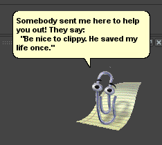

# ClippyForMaya
<b>Overview</b>

 

Adds Clippy from Microsoft Office to Autodesk Maya. This was done as an April Fool's Day joke at Reel FX. Ryan Bland is responsible for the majority of the heavy lifting on the code, I contributed some of the event callback code so that Clippy reacts to user input to various actions in Maya. Nick Hurm provided the animated PNGs used for Clippy from the website <a href="https://www.smore.com/clippy-js">ClippyJS</a>. This code is provided as-is, and hasn't been tested outside of the studio environment so getting it set up to run with a basic Maya installation may take some modification.
